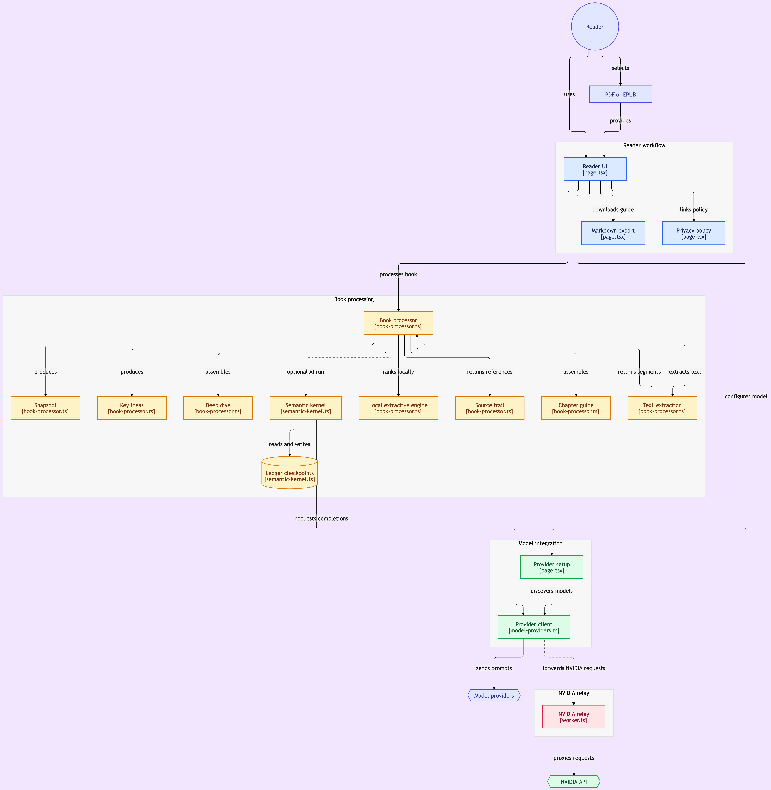

# Leafmark

Leafmark is a privacy-first book-summary web app. A reader brings a PDF or EPUB they have the right to use and chooses local processing or connects their own free, paid, local, or self-hosted AI model.

Public site: https://utsapoddar.github.io/leafmark/

## Architecture and walkthrough

[](docs/media/architecture.png)

### Video walkthrough

https://github.com/user-attachments/assets/9d83b676-4f97-4243-8acf-a98f6b0dfe40

## Product model

- **Snapshot:** a two-minute overview of the whole book.
- **Key ideas:** the arguments and claims worth retaining.
- **Chapter guide:** a detailed, sequential companion targeting roughly 55% of the uploaded book.
- **Deep dive:** the fullest source-grounded guide, targeting roughly 80% while preserving substantive material and removing repetition, transitions, and other nonessential prose.
- **Source trail:** each item retains a page or EPUB-section reference.
- **Export:** the generated reading guide can be downloaded as Markdown.

The initial engine is deliberately extractive. It ranks and assembles sentences from the source locally, which makes it free, fast, private, and less prone to invented claims. It does not yet OCR scanned/image-only PDFs.

Reading times are estimates, not limits. A short story can produce a guide under an hour; an unusually long work can produce one well beyond five hours. Depth is determined by the share of substantive source material retained, and the result screen reports the actual estimated reading time generated from the uploaded text.

## How it works

1. **Parse in the browser.** PDF.js reads PDFs; JSZip and DOM APIs read EPUBs. Every sentence keeps its page or section reference, and chapters are detected from the book's outline (`lib/book-processor.ts`).
2. **Local engine (default).** An extractive ranker selects and assembles source sentences on the device. There is no model call and no network request.
3. **Optional model path** (`lib/semantic-kernel.ts`). Source sentences are chunked, and each chunk goes to the reader's chosen provider (`lib/model-providers.ts`: Gemini, Groq, Cerebras, Kimi, NVIDIA via relay, or any OpenAI-compatible endpoint) for a structured content ledger. Requests retry with backoff on 429 and 5xx. A malformed response gets one JSON-repair pass; if that also fails validation, the run stops with a clear error. Each validated chunk is checkpointed, so a retry, refresh, or model switch resumes instead of starting over.
4. **Assemble on the device.** The short views are synthesized from the ledger, the long views are assembled from source sentences, and the guide exports as Markdown.

Leafmark uses a bring-your-own-book model, so it does not license, host, or distribute a commercial catalog.

## Bring your own model

The current release has no metered model API and no app database. PDF parsing uses PDF.js, EPUB parsing uses JSZip and browser DOM APIs, and the extractive engine runs on the reader's device. Static hosting can therefore stay within common free tiers. NVIDIA is the sole CORS exception: its optional, stateless [privacy relay](relay/README.md) forwards each reader's own key and bounded excerpts without storing them.

The implemented [provider kernel](docs/provider-kernel.md) lets each reader connect a free API key, paid API key, or self-hosted OpenAI-compatible endpoint. It extracts and labels source sentences locally, asks the selected model for a validated content ledger, synthesizes the short views, and assembles the long source-grounded views on the reader's device. Credentials belong to each reader and are never included in the public site.

Future improvements should preserve the same boundary:

1. Add opt-in browser OCR for scanned pages.
2. Add an optional on-device language model for abstractive summaries on capable hardware.
3. Add an in-app control to delete saved excerpt checkpoints. They are currently kept in this browser's IndexedDB until the site's data is cleared (see the [privacy page](https://utsapoddar.github.io/leafmark/privacy/)).
4. Add a question mode whose answers always cite extracted sections.
5. Store a local library in IndexedDB, with explicit delete controls.
6. Add [Lecture Mode](docs/lecture-mode.md): a source-grounded teaching sequence that explains one idea at a time, checks recall, adapts the next explanation, and never advances silently past a misunderstanding.

Do not build a public repository of user-generated summaries for copyrighted books without a separate rights and legal review. Keep uploads and generated guides private by default.

## Development

```bash
npm install
npm run dev
npm run build
npm test        # 31 tests: book processing, providers, relay, semantic kernel
npm run lint
```
